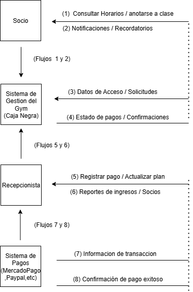

## **Actores Externos (Los que interactúan):**
**Socio**: La persona que va al gimnasio. Es el más importante.

**Recepcionista:** El empleado que usa el sistema todos los días en la recepción.

**Sistema de Pagos:** Una plataforma externa (como Mercado Pago o un banco) que procesa el dinero.

**Flujos de Entrada (Hacia el Sistema):**
**De Socio:** Consultar horarios de clases o intentar apuntarse a una.

**De Socio:** Ingresar credenciales (huella o código) para entrar.

**De Recepcionista:** Registrar un nuevo pago manualmente o actualizar el plan de un socio.

**De Sistema de Pagos:** Enviar una confirmación de que un pago automático fue exitoso.

**Flujos de Salida (Desde el Sistema):**
**Hacia Socio:** Enviar una notificación o recordatorio de pago o de su clase.

**Hacia Socio:** Mostrarle los horarios disponibles y confirmar su inscripción a una clase.

**Hacia Recepcionista:** Mostrarle un reporte de socios morosos o de ingresos del mes.

**Hacia Sistema de Pagos:** Enviar una solicitud para cobrar la cuota mensual de un socio.

